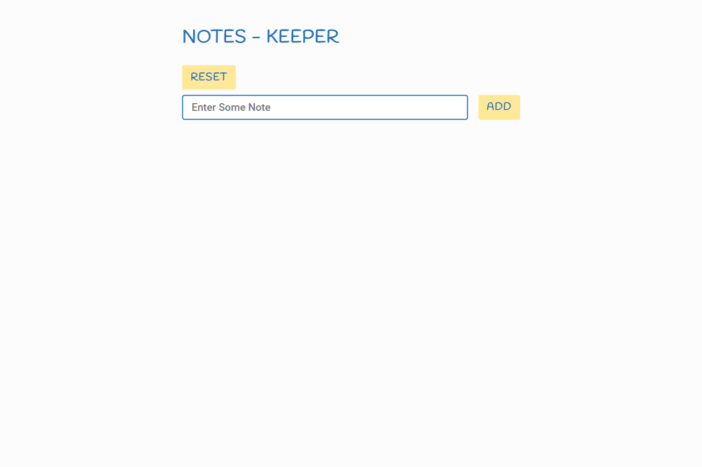
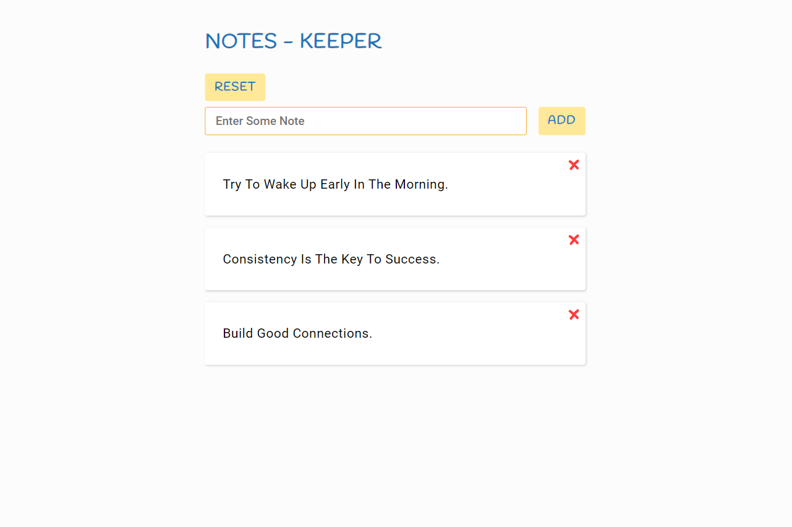

# 📒 notes-keeper

This project is a notes keeper page where you write and save your notes, pieces of advice, grocery items, or in short whatever you want. Your notes will store in your browse's local storage so nobody else on the internet can access your notes.

### technologies

Its created in HTML, CSS, and JS. Its created with the concept of DOM manipulation in JS. It stores your data in your browser's local storage.

## screens

## site link

By [Clicking Me](https://msarmadqadeer.github.io/notes-keeper/) you'll see the live version of this project. If you like the project, star ⭐ the repo!
